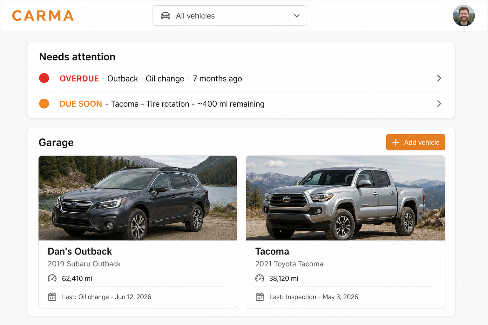
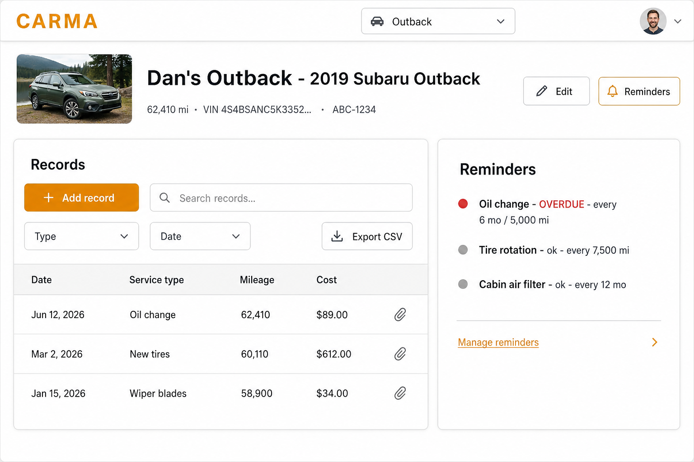

# Carma

A self-hosted vehicle maintenance tracker for the household, planned for
`https://carma.bitofbytes.io`. Track maintenance and repair records across every
car in the garage, attach receipts, get reminded when routine service is due, and
export the history when it's time to sell.

**Status: MVP implemented.** The repository contains the Go/HTMX application,
PostgreSQL migrations, local memory preview, filesystem-backed receipt storage,
container build, and CI workflow described by the project plan.

## Local development

Requirements: Go 1.26.x. Run `make run`, open `http://localhost:4700`, and use the
clearly labeled local developer login. This mode uses an in-memory store and writes
uploads below `.local/carma-assets`; configuration rejects development auth when
`APP_ENV=production`.

For PostgreSQL, run `make db-up`, `make migrate`, then `make run-postgres`.
Production configuration uses Google OIDC and requires a verified email to match
`AUTH_GOOGLE_ALLOWED_EMAILS` or `AUTH_GOOGLE_ALLOWED_DOMAINS`.

Validation commands are `make test`, `make lint`, and `make build`.

## What it will do

- **Vehicles** - manage the whole household garage; every allowlisted user sees
  and edits the same vehicles.
- **Records** - log service/repairs with date, type, odometer, cost, vendor, and
  notes; search, sort, and filter the history.
- **Receipts** - attach PDF/photo receipts to any record; stored on the NAS, no
  more glove-box paper.
- **Reminders** - time- and/or mileage-based intervals per vehicle and service
  type; overdue and due-soon surfaced on the dashboard. Email reminders are a
  stretch goal.
- **Export** - filtered CSV (XLSX later) of any records view.

## How it will be built

Go monolith + HTMX (the dined pattern), single Docker image, Postgres on bahamut,
receipts on an NFS volume, deployed to the crystal1 Docker Swarm by the standard
GitHub Actions → Tailscale registry → bare-repo post-receive pipeline. Stack file,
Traefik route, and deploy hook will live in `home_swarm` as usual.

## Documentation

| Doc | Contents |
|---|---|
| [docs/PRD.md](docs/PRD.md) | Features, MVP vs stretch scope, data model, permissions, acceptance criteria |
| [docs/ARCHITECTURE.md](docs/ARCHITECTURE.md) | Stack decisions, repo layout, storage, reminder engine, CI/CD flow |
| [docs/INFRA.md](docs/INFRA.md) | Naming, stack/Traefik/hook definitions for home_swarm, one-time bootstrap checklist |
| [docs/UI.md](docs/UI.md) | User flows, screen wireframes, HTMX interaction notes |
| [docs/mockups/](docs/mockups/) | Visual mockups of the key screens |

## Design preview

