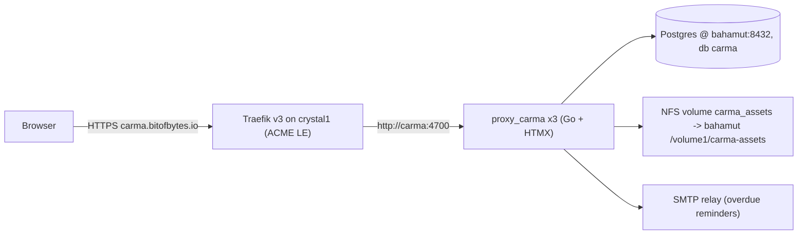
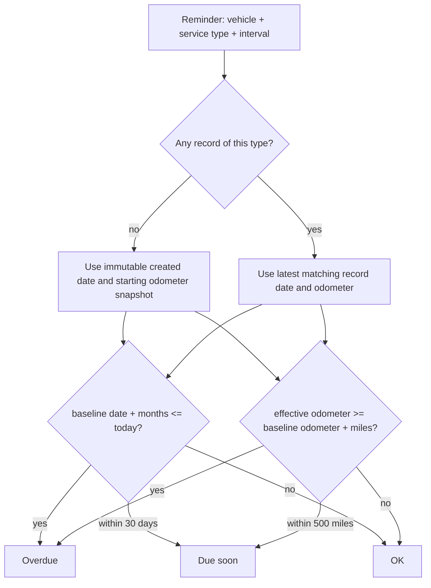
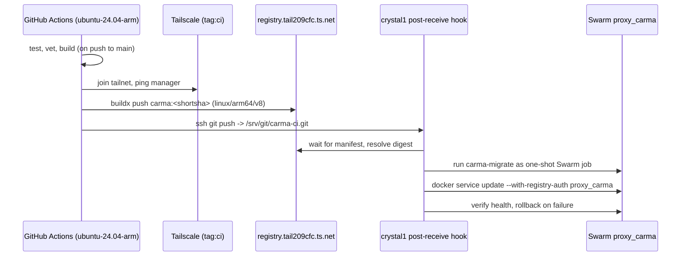

# Carma - Architecture

Carma follows the **dined pattern**: a single Go binary serving server-rendered HTML
enhanced with HTMX, deployed as one Docker image to the crystal1 Swarm. It borrows
two pieces from noted: the NFS-backed asset store for receipt files and the
automatic migration job in the deploy hook.

## Stack

| Layer | Choice | Precedent |
|---|---|---|
| Language | Go (latest stable, currently 1.26.x) | dined |
| HTTP router | chi (`github.com/go-chi/chi/v5`) | dined, noted |
| Frontend | Server-rendered HTML + HTMX (`static/htmx.min.js`), hand-authored CSS | dined |
| Database | PostgreSQL on bahamut (`192.168.1.2:8432`), database `carma` | both |
| Data access | Raw SQL via pgx/v5 (`pgxpool`), no ORM | both |
| Migrations | Numbered SQL files, embedded, applied by a `carma-migrate` binary at deploy time | noted |
| Auth | Google OAuth/OIDC + email allowlist + hashed cookie sessions | dined |
| File storage | Opaque-key filesystem store on NFS volume (`/data/assets`) | noted |
| Export | `encoding/csv` (stdlib); XLSX later via `github.com/xuri/excelize/v2` | new |
| Email | stdlib SMTP over implicit TLS, password via `carma_smtp_password` | new |

### Why a monolith + HTMX and not an SPA

The UI is forms, sortable tables, file uploads, and status lists - all of which
dined already does well with HTMX. A single image means one Dockerfile, one CI
build, one Swarm service, and no CORS/API-versioning concerns. Noted needed Angular
for its interactive PDF reader; carma has no equivalent complexity.

## Runtime topology



- **Port:** 4700 (dined uses 4600, noted 8080; each app gets its own).
- **Replicas:** 3, spread across nodes, start-first rolling updates with rollback on
  failure (same `deploy:` block as dined/noted).
- **Traefik:** file-provider router (no Swarm labels), `Host(carma.bitofbytes.io)`,
  `websecure` entrypoint, `le` cert resolver, `secure-headers` +
  `private-app-limit` middlewares. See [INFRA.md](INFRA.md).
- **Health:** `GET /health` returns 200 with no auth; used by the Dockerfile
  HEALTHCHECK and the deploy hook.

## Repository layout (planned)

```
carma/
├── cmd/
│   ├── carma/            # main server binary
│   └── carma-migrate/    # migration runner (built into the same image)
├── internal/
│   ├── auth/             # Google OIDC, sessions, allowlist (ported from dined)
│   ├── config/           # env + /run/secrets *_FILE loading (getEnvOrFile pattern)
│   ├── handler/          # HTTP handlers (pages, records, vehicles, reminders, export)
│   ├── middleware/       # auth, logging, same-origin
│   ├── model/            # domain types + validation
│   ├── repository/       # pgx SQL for vehicles/records/attachments/reminders
│   ├── assets/           # filesystem asset store (ported from noted)
│   ├── reminder/         # due-status computation
│   ├── reminderemail/    # scheduler, runner, and message rendering
│   ├── mailer/           # implicit-TLS SMTP client
│   ├── export/           # CSV (later XLSX) writers
│   └── ui/               # html/template views, HTMX partials
├── migrations/           # 001_..., embedded via embed.go
├── static/               # styles.css, htmx.min.js, favicons
├── docs/                 # this documentation
├── Dockerfile
├── Makefile
├── local.mk.example
└── .github/workflows/ci.yml
```

## Request handling

- Full page loads render complete templates; HTMX requests (`HX-Request` header)
  render partials (e.g. the records table body after a filter change, the reminder
  panel after logging a record).
- Mutations are form POSTs. Same-origin middleware (as in dined) protects against
  CSRF for cookie-authenticated form posts.
- Records list querying (search/sort/filter) is one parameterized SQL query; the
  same query feeds both the HTML table and the CSV export, so exports always match
  the on-screen view.

## File storage (receipts, vehicle photos)

Ported from noted's `internal/assets`:

- `Store` interface with a `LocalStore` implementation rooted at `ASSET_ROOT`
  (`/data/assets` in prod, `.local/carma-assets` locally).
- Keys are opaque: `ab/<uuid>.<ext>` (two-hex-char shard directory). The DB maps
  keys to original filenames and content types.
- Upload path: multipart form → magic-byte sniff (`%PDF-`, JPEG/PNG/WebP/HEIC
  signatures) → size check (25 MiB cap via `MAX_UPLOAD_BYTES`) → write to a
  `temporary/` staging dir → fsync + rename into `objects/` → insert `attachments`
  row in the same request.
- Download path: `http.ServeContent` for byte-range support (large PDFs on iOS).
- Deletes remove the DB row first, then best-effort remove the file.
- Durability: the volume is an NFS export on bahamut covered by the existing
  Hyper Backup job, same as noted's `/volume1/noted-assets`.

## Reminder engine

Due status is **computed, never stored**, so it can't drift:



One SQL query joins reminders to the latest matching record and the vehicle's
effective odometer (the greater of its manually maintained current odometer and all
record readings); the handler classifies each row as overdue / due soon / ok. A
reminder snapshots that effective odometer when first created. Edits preserve its
creation date and snapshot, while logging a matching record naturally replaces both
first-cycle baselines.

## Email reminders

- `internal/reminderemail.Schedule`: runs at startup and daily; its runner takes a Postgres session advisory lock
  (`pg_try_advisory_lock`) so only one of the 3 replicas sends.
- For each enabled, overdue reminder: skip if a `reminder_notifications` row exists
  within the last 30 days; otherwise send and log.
- `internal/mailer`: authenticated SMTP over certificate-verified implicit TLS.
  Separate configuration fields keep the password in a password-only `*_FILE` secret.
  `REMINDER_EMAIL_ENABLED=false` leaves the scheduler off.
- Email content: vehicle, service type, baseline (last done date/mileage), what
  triggered it (time or mileage), and a link to the vehicle page.

## Configuration

Same `getEnvOrFile` convention as dined/noted - every secret readable from env or
`/run/secrets/<name>` via `*_FILE`:

| Variable | Prod source | Purpose |
|---|---|---|
| `APP_ENV` | stack env (`production`) | prod behaviors (secure cookies) |
| `PORT` | stack env (`4700`) | listen port |
| `DATABASE_URL` | secret `carma_database_url` | Postgres DSN |
| `DATA_STORE` | stack env (`postgres`; `memory` for local preview) | repo selection |
| `AUTH_GOOGLE_CLIENT_ID` / `_SECRET` | secrets `carma_google_client_id` / `_secret` | OIDC |
| `AUTH_GOOGLE_REDIRECT_URL` | stack env | `https://carma.bitofbytes.io/api/auth/google/callback` |
| `AUTH_GOOGLE_ALLOWED_EMAILS` | stack env | comma-separated allowlist |
| `SESSION_TTL` | default `2160h` | session lifetime |
| `ASSET_ROOT` | stack env (`/data/assets`) | receipt/photo storage root |
| `MAX_UPLOAD_BYTES` | stack env (`26214400`) | 25 MiB upload cap |
| `MAX_MULTIPART_BYTES` | stack env (default `134217728`) | 128 MiB total multipart request cap; supports four maximum-size receipts plus overhead |
| `SMTP_PASSWORD` | secret `carma_smtp_password` via `SMTP_PASSWORD_FILE` | email reminders |

## CI/CD pipeline

Cloned from dined's single workflow (`ci.yml`), which is the simpler of the two
precedents and sufficient for one image:



The post-receive hook is noted's variant (migration job + rollback) adapted to a
single service. Stack file, Traefik routes, and the hook live in `home_swarm`, not
this repo - see [INFRA.md](INFRA.md).

## Local development

- `make run` - in-memory store (`DATA_STORE=memory`), no Postgres needed, dev auth
  mode with a seeded local user (noted's `AUTH_MODE=development` idea) so Google
  OAuth isn't required to hack on the UI.
- `make db-up` / `make run-postgres` - local Postgres via a small
  `compose.local.yml` (host port 5435 to avoid colliding with noted's 5434).
- `make migrate` - apply migrations locally.
- Assets land in `.local/carma-assets` (gitignored).
- `local.mk` (gitignored) for developer-specific overrides, per dined convention.
