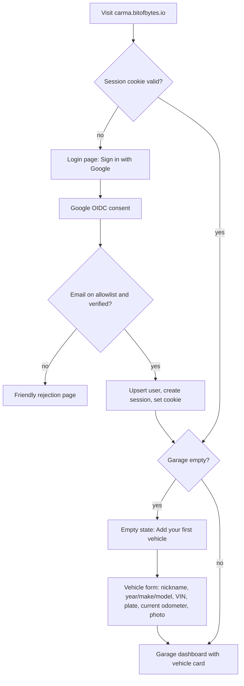
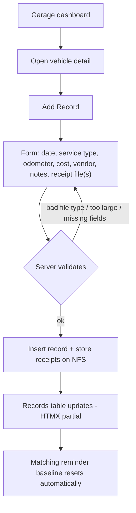
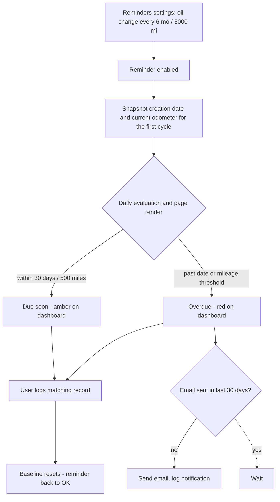
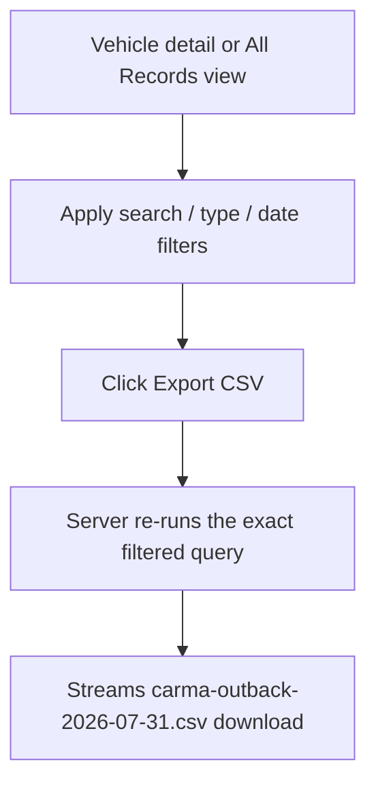

# Carma - UI, User Flows, and Wireframes

Server-rendered HTML + HTMX, styled like dined (clean, utility-class CSS, works on
phone widths). Visual mockups of these screens live in [mockups/](mockups/):

- [01-garage-dashboard.png](mockups/01-garage-dashboard.png)
- [02-vehicle-detail.png](mockups/02-vehicle-detail.png)
- [03-add-record.png](mockups/03-add-record.png)
- [04-reminders-settings.png](mockups/04-reminders-settings.png)

The mockups are directional, not pixel-specs. (Note: the reminders mockup shows
"Fuel" and "Reports" nav items that are out of scope - see non-goals in
[PRD.md](PRD.md); the real nav is Garage / vehicle switcher / account only.)

## Navigation model

```
Login ──> Garage (dashboard)
             ├──> Vehicle detail ──> Add/Edit record ──> Record detail
             │        ├──> Reminders settings
             │        └──> Export (CSV download)
             └──> Add vehicle
```

Top bar on every page: Carma wordmark (links to garage), vehicle switcher dropdown,
user avatar menu (sign out).

## User flows

### First login and vehicle setup



### Log a service with a receipt



### Reminder lifecycle



### Export



## Screen wireframes

### 1. Garage dashboard (`/`)

```
┌──────────────────────────────────────────────────────────────┐
│ CARMA                                    [All Vehicles ▾] (D)│
├──────────────────────────────────────────────────────────────┤
│  Needs attention                                             │
│  ┌────────────────────────────────────────────────────────┐  │
│  │ ● OVERDUE   Outback   Oil change    7 mo ago / 5,410 mi│  │
│  │ ● DUE SOON  Tacoma    Tire rotation ~400 mi remaining  │  │
│  └────────────────────────────────────────────────────────┘  │
│                                                              │
│  Garage                                       [+ Add vehicle]│
│  ┌──────────────────┐  ┌──────────────────┐                  │
│  │ [photo]          │  │ [photo]          │                  │
│  │ Dan's Outback    │  │ Tacoma           │                  │
│  │ 2019 Subaru      │  │ 2021 Toyota      │                  │
│  │ 62,410 mi        │  │ 38,120 mi        │                  │
│  │ Last: oil change │  │ Last: inspection │                  │
│  │   Jun 12, 2026   │  │   May 3, 2026    │                  │
│  └──────────────────┘  └──────────────────┘                  │
└──────────────────────────────────────────────────────────────┘
```

### 2. Vehicle detail (`/vehicles/{id}`)

```
┌──────────────────────────────────────────────────────────────┐
│ CARMA                                    [Outback ▾]      (D)│
├──────────────────────────────────────────────────────────────┤
│ Dan's Outback - 2019 Subaru Outback        [Edit] [Reminders]│
│ 62,410 mi · VIN 4S4BS...  · ABC-1234                         │
├───────────────────────────────┬──────────────────────────────┤
│ Records      [+ Add record]   │ Reminders                    │
│ [search….] [Type ▾] [Dates ▾] │ ● Oil change     OVERDUE     │
│              [Export CSV]     │   6 mo / 5,000 mi            │
│ ┌───────────────────────────┐ │ ○ Tire rotation  ok          │
│ │ Date▾   Type     Mi   Cost│ │   7,500 mi                   │
│ │ 6/12/26 Oil chg 62410  $89│ │ ○ Cabin filter   ok          │
│ │ 3/02/26 Tires   60110 $612│ │   12 mo                      │
│ │ 1/15/26 Wipers  58900  $34│ │                              │
│ │ …                      📎 │ │ [Manage reminders]           │
│ └───────────────────────────┘ │                              │
└───────────────────────────────┴──────────────────────────────┘
```

(📎 marks rows with receipts. On phones the reminders panel stacks above the
table.)

### 3. Add / edit record (`/vehicles/{id}/records/new`)

```
┌──────────────────────────────────────────────┐
│ Add record - Dan's Outback                   │
├──────────────────────────────────────────────┤
│ Date          [2026-07-31]                   │
│ Service type  [Oil change            ▾][+new]│
│ Odometer (mi) [62,410      ]                 │
│ Cost          [$ 89.00     ]                 │
│ Vendor        [Jiffy Lube  ]                 │
│ Notes         [0W-20 full synthetic…       ] │
│ Receipts      [Choose files…] receipt.pdf ✕  │
│                                              │
│              [Cancel]  [Save record]         │
└──────────────────────────────────────────────┘
```

On mobile, "Choose files" opens the camera so a paper receipt can be photographed
directly into the form.

### 4. Record detail (`/records/{id}`)

```
┌──────────────────────────────────────────────┐
│ Oil change - Jun 12, 2026     [Edit] [Delete]│
├──────────────────────────────────────────────┤
│ Vehicle   Dan's Outback                      │
│ Odometer  62,410 mi        Cost  $89.00      │
│ Vendor    Jiffy Lube       By    Daniel      │
│ Notes     0W-20 full synthetic, filter #7317 │
│                                              │
│ Receipts                                     │
│ ┌────────┐ ┌────────┐                        │
│ │ [thumb]│ │  PDF   │   [+ Add receipt]      │
│ │ IMG_02 │ │invoice │                        │
│ └────────┘ └────────┘                        │
└──────────────────────────────────────────────┘
```

### 5. Reminders settings (`/vehicles/{id}/reminders`)

```
┌──────────────────────────────────────────────────────┐
│ Reminders - Dan's Outback              [+ Add]       │
├──────────────────────────────────────────────────────┤
│ Service type   Every (months)  Every (miles)  On/Off │
│ Oil change     [ 6 ]           [ 5000 ]        [on ] │
│ Tire rotation  [   ]           [ 7500 ]        [on ] │
│ Cabin filter   [12 ]           [     ]         [on ] │
│ Coolant        [36 ]           [30000]         [off] │
│                                                      │
│ Due when either the time or mileage interval is      │
│ reached, measured from the last matching record.     │
└──────────────────────────────────────────────────────┘
```

(Recipients come from the normalized Carma user list; reminders do not have a
per-row recipient field.)

### 6. Login (`/login`)

```
┌──────────────────────────────┐
│                              │
│           CARMA              │
│   Track every mile of        │
│   maintenance.               │
│                              │
│   [ G  Sign in with Google ] │
│                              │
│   Access is invite-only.     │
└──────────────────────────────┘
```

## HTMX interaction notes

- Records search/filter/sort: inputs trigger `hx-get` on the table body partial
  with a small debounce; URL query params kept in sync (`hx-push-url`) so filtered
  views are shareable and drive the CSV export.
- Reminder toggles and interval edits: inline `hx-post` per row, no full page
  reload.
- Receipt upload: standard multipart form post (progress via browser); thumbnails
  lazy-loaded.
- Delete actions use `hx-confirm` dialogs.

## Visual direction

- Same family as dined: white cards on a light neutral background, one accent color
  (a garage-y amber/orange), system font stack, generous touch targets.
- Status colors: red = overdue, amber = due soon, green/neutral = ok.
- Mobile-first layouts; the records table collapses to stacked cards under ~640px.
